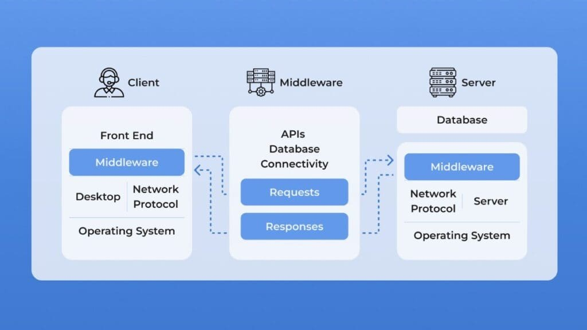
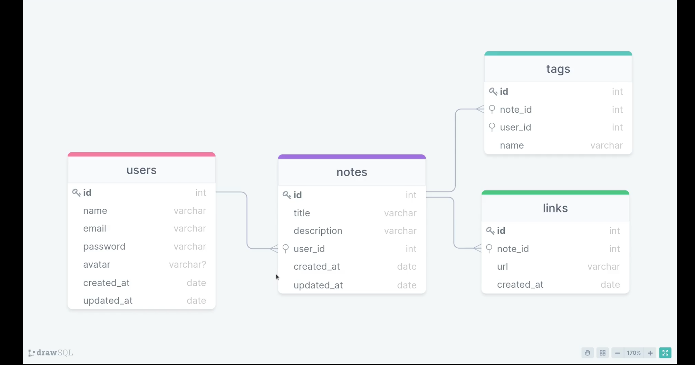

<h1 align="center"> Primeira API </h1>

Programa de desenvolvimento Fullstack promovido pela Rocketseat  

  <a href="#-tecnologias">Tecnologias</a>&nbsp;&nbsp;&nbsp;|&nbsp;&nbsp;&nbsp;
  <a href="#-aprendizado">Aprendizado</a>&nbsp;&nbsp;&nbsp;|&nbsp;&nbsp;&nbsp;
  <a href="#-projeto">Projeto</a>&nbsp;&nbsp;&nbsp;|&nbsp;&nbsp;&nbsp;
  <a href="#memo-licença">Licença</a>

  

 

## 🚀 Tecnologias

Esse projeto foi desenvolvido com as seguintes tecnologias:

- Node
- Express
- Insomnia
- Beekeeper Studio
- SQLite
- Knex
- Git e Github

## 💻 Aprendizado

Neste projeto adquiri conhecimento sobre:

- Rotas e métodos HTTP
- Rote e Query Params
- Nodemon
- Middleware
- Banco de dados relacionais
- Comandos DML (CRUD)
- SQL Query
- Migration
- Primary e Foreign Key
- Cardinalidade
- Git e Github

## 🔖 Projeto

  

  

## :memo: Licença

Esse projeto está sob a licença MIT.

